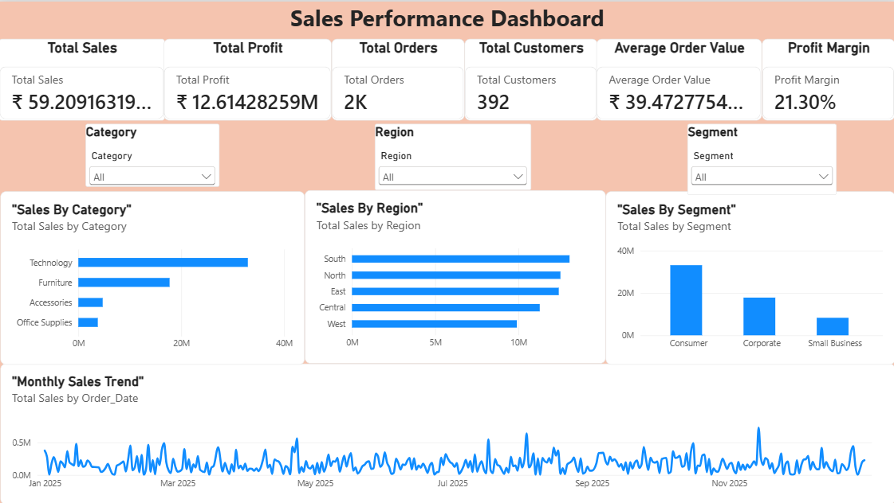

# Customer & Sales Analytics

## 📊 Project Overview

Customer & Sales Analytics is an end-to-end data analytics project designed to analyze customer behavior, sales performance, profitability, product performance, regional trends, and business segments.

The project uses **MySQL, Excel, Power BI, and GitHub** to demonstrate the complete data analytics workflow — from raw data cleaning and SQL analysis to Excel reporting and interactive dashboard visualization.

---

## 🎯 Project Objectives

- Analyze overall sales and profit performance
- Understand customer purchasing behavior
- Identify high-value and repeat customers
- Compare different customer segments
- Analyze regional sales performance
- Evaluate category and product performance
- Study monthly sales trends
- Analyze payment methods
- Understand the impact of discounts on profitability
- Identify high-value transactions
- Generate business insights using dashboards

---

## 🛠️ Tools & Technologies

- **MySQL** – Data cleaning, querying, and business analysis
- **Microsoft Excel** – Data analysis and reporting
- **Power BI** – Interactive dashboard and visualization
- **GitHub** – Project version control and portfolio

---

## 📁 Dataset

The dataset contains **1,500 sales transactions** across **400 customers** during **2025**.

### Dataset Columns

| Column | Description |
|---|---|
| Order_ID | Unique order identifier |
| Order_Date | Date of the order |
| Customer_ID | Unique customer identifier |
| Customer_Name | Customer name |
| Region | Sales region |
| Segment | Customer segment |
| Category | Product category |
| Product | Product name |
| Quantity | Quantity purchased |
| Sales | Sales amount |
| Discount | Discount applied |
| Profit | Profit generated |
| Payment_Mode | Payment method |

---

## 🔍 SQL Analysis

The MySQL analysis includes:

### Data Quality
- Missing value checks
- Duplicate order checks
- Invalid quantity checks
- Invalid sales and profit checks

### Business Analysis
- Overall sales and profit
- Customer-level analysis
- Top 10 customers by sales
- Top 10 customers by profit
- Customer order frequency
- Repeat customer analysis
- Customer type segmentation
- Segment performance
- Regional performance
- Category performance
- Product performance
- Monthly sales trends
- Monthly customer activity
- Monthly regional performance
- Payment method analysis
- Discount impact analysis
- High-value orders
- Category × Segment analysis
- Region × Segment analysis
- Average order value by segment
- Products with above-average sales and low profit margins

---

## 📈 Excel Analysis

The Excel workbook contains structured analysis and reporting using Excel Tables and formulas.

### Key Areas

- Overall business summary
- Category analysis
- Sales analysis
- Profit analysis
- Quantity analysis
- Profit margin analysis
- Dashboard visualization

Excel functions used include:

- `SUM`
- `COUNTA`
- `UNIQUE`
- `COUNTIF`
- `SUMIF`
- Calculated percentages
- Excel Tables

---

## 📊 Power BI Dashboard

The Power BI dashboard provides an interactive view of customer and sales performance.

### Dashboard Analysis

- Sales performance
- Profit performance
- Customer analysis
- Category performance
- Regional performance
- Segment performance
- Monthly trends
- Business performance indicators

### Dashboard Preview



---

## 📂 Project Structure

```text
customer-sales-analytics/
│
├── data/
│   └── customer_sales_1500_rows.csv
│
├── sql/
│   └── customer_sales_analysis.sql
│
├── excel/
│   └── customer_sales_analysis.xlsx
│
├── powerbi/
│   └── customer_sales_dashboard.pbix
│
├── screenshots/
│   └── dashboard.png
│
└── README.md
